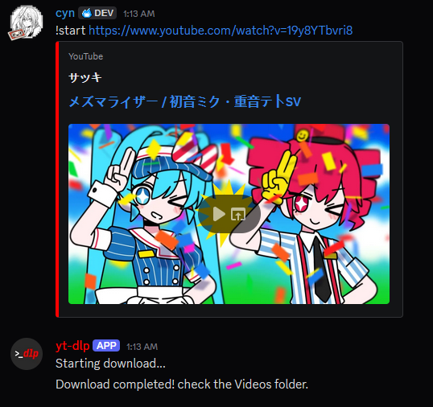

# Preview

A **very** simple Discord bot that uses `yt-dlp` to download YouTube videos locally.

## Setup

1. Make sure you already have a Discord bot set up.  
   If you do not know how to do this, I recommend following this video by Tech with Tim:  
  [Video](https://www.youtube.com/watch?v=YD_N6Ffoojw&t=1604s)

2. Download the `.py`.

3. Download the latest `.exe` file from [yt-dlp](https://github.com/yt-dlp/yt-dlp)  
   then place it in the same directory as `bot.py`.

4. Run `bot.py`

## Note
This Discord bot is very basic and not particularly polished.  
I made it to suit my own needs for running `yt-dlp` via Discord,  
since I got really tired of copy-pasting  
`yt-dlp -f "bestvideo[ext=mp4]+bestaudio[ext=m4a]/best[ext=mp4]/best" https://www.youtube.com/watch?v=dQw4w9WgXcQ"`  
every single time.
